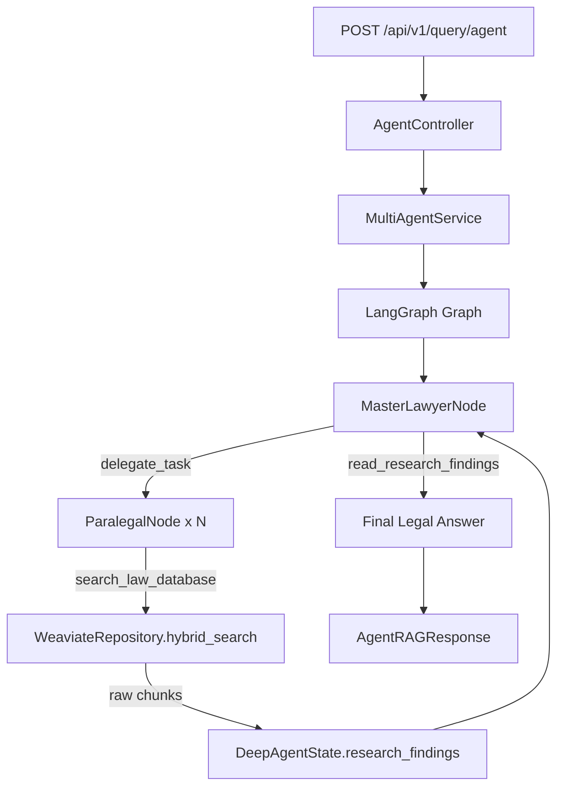

# Kế Hoạch Triển Khai: Multi-Agent System (LangGraph) cho RAG Backend

> Dựa trên phân tích kiến trúc hiện tại: FastAPI + Clean Architecture (4 layers) + Weaviate + LangChain

---

## Tổng Quan Kiến Trúc Mới



**Nguyên tắc tích hợp:**
- Multi-Agent là một **service mới** trong `application/services/` — không phá vỡ pipeline RAG hiện tại
- Tất cả I/O qua Weaviate vẫn dùng `VectorRepository` interface (Clean Architecture)
- Prompts đăng ký vào `PromptManager` hiện có
- DI Container thêm `multi_agent_service()` factory method

---

## Danh Sách Files Cần Tạo / Sửa

### 🆕 Files Mới Tạo

| # | File Path | Mục Đích |
|---|-----------|----------|
| 1 | `domain/models/agent_state.py` | Định nghĩa `DeepAgentState` (TypedDict) — State dùng chung toàn graph |
| 2 | `application/services/multi_agent_service.py` | **Entry point** — build LangGraph, expose `run()` method |
| 3 | `application/agents/master_lawyer_agent.py` | Logic node Master Lawyer (phân tích, TODO, delegate) |
| 4 | `application/agents/paralegal_agent.py` | Logic node Paralegal (search, raw-text extract, no-summarize) |
| 5 | `application/agents/agent_tools.py` | Tất cả Tool definitions (write_todos, delegate_task, search_law_database, think_tool, ...) |
| 6 | `application/agents/__init__.py` | Package init |
| 7 | `presentation/schemas/agent_schemas.py` | Pydantic schemas cho Agent API (request/response) |
| 8 | `presentation/controllers/agent_controller.py` | AgentController — nhận request, gọi MultiAgentService |
| 9 | `presentation/routes/agent_routes.py` | Router: `POST /api/v1/query/agent` |

### ✏️ Files Cần Sửa

| # | File Path | Thay Đổi | Lý Do |
|---|-----------|----------|-------|
| 10 | `domain/interfaces/vector_repository.py` | Thêm abstract method `hybrid_search()` | Paralegal tool cần wrap hàm này |
| 11 | `infrastructure/vector_db/weaviate_repository.py` | Implement `hybrid_search()` | Weaviate hybrid search BM25+vector |
| 12 | `application/prompt/prompt_manager.py` | Thêm 2 template: `master_lawyer_system`, `paralegal_system` | Quy tắc: không hardcode prompt |
| 13 | `di/container.py` | Thêm `multi_agent_service()` factory + `agent_controller()` | Composition Root pattern |
| 14 | `main.py` | Mount `agent_routes.router` + wire `agent_controller` vào `app.state` | Expose API endpoint |

---

## Chi Tiết Từng File

### File 1: `domain/models/agent_state.py` *(Tạo mới)*

**Mục đích:** Định nghĩa schema State dùng chung bởi tất cả nodes trong LangGraph.

```python
# Vị trí: src/rag_backend/domain/models/agent_state.py
from typing import TypedDict, Annotated
from langchain_core.messages import BaseMessage
import operator

class ResearchFinding(TypedDict):
    task_description: str       # Mô tả task từ Master
    law_uuid: str | None        # UUID bộ luật (nếu có)
    query_used: str             # Query Paralegal đã dùng
    chunks: list[dict]          # RAW text chunks từ Weaviate (KHÔNG summarize)
    paralegal_id: str           # ID của Paralegal agent

class TodoItem(TypedDict):
    task: str
    status: str                 # "pending" | "in_progress" | "done"
    paralegal_id: str | None

class DeepAgentState(TypedDict):
    messages: Annotated[list[BaseMessage], operator.add]   # Message history
    todos: list[TodoItem]                                   # Task list của Master
    research_findings: list[ResearchFinding]               # Kết quả RAW từ Paralegal
    original_question: str                                 # Câu hỏi gốc
    final_answer: str | None                               # Câu trả lời cuối cùng
    iteration_count: int                                   # Đếm vòng lặp (hard limit)
    max_iterations: int                                    # Config: giới hạn tối đa
```

**Tại sao TypedDict thay vì Pydantic?** LangGraph yêu cầu State phải là `TypedDict` (hoặc dùng `Annotated` reducer). Pydantic không work trực tiếp với LangGraph state reducers.

---

### File 2: `application/services/multi_agent_service.py` *(Tạo mới)*

**Mục đích:** Build LangGraph graph, expose `run(question: str) -> AgentResult`.

```python
# Cấu trúc graph:
# START → master_node → [spawn paralegal_node x N (parallel)] → master_node → END

from langgraph.graph import StateGraph, END
from rag_backend.domain.models.agent_state import DeepAgentState

class MultiAgentService:
    def __init__(self, master_agent, paralegal_factory, max_iterations=5):
        self._graph = self._build_graph(master_agent, paralegal_factory)
        self._max_iterations = max_iterations

    def _build_graph(self, master_agent, paralegal_factory) -> CompiledGraph:
        builder = StateGraph(DeepAgentState)
        builder.add_node("master", master_agent.run)
        builder.add_node("paralegal", paralegal_factory.run_parallel)
        builder.set_entry_point("master")
        builder.add_conditional_edges(
            "master",
            self._route_after_master,   # routing function
            {"delegate": "paralegal", "finish": END}
        )
        builder.add_edge("paralegal", "master")  # Paralegal → Master để tổng hợp
        return builder.compile()

    async def run(self, question: str) -> dict:
        initial_state = DeepAgentState(
            messages=[], todos=[], research_findings=[],
            original_question=question, final_answer=None,
            iteration_count=0, max_iterations=self._max_iterations
        )
        result = await self._graph.ainvoke(initial_state)
        return result
```

---

### File 3: `application/agents/master_lawyer_agent.py` *(Tạo mới)*

**Mục đích:** Node Master Lawyer — phân tích câu hỏi, tạo TODOs, đọc findings, viết câu trả lời cuối.

**Logic:**
1. Lần 1 (iteration=0): Phân tích câu hỏi → `write_todos()` → `delegate_task()` cho từng TODO
2. Lần 2+ (có findings): Đọc `read_research_findings()` → synthesize → viết `final_answer`
3. **Hard limit**: Nếu `iteration_count >= max_iterations` → force stop

**Tool binding:** Master bind 4 tools: `write_todos`, `read_todos`, `delegate_task`, `read_research_findings`

**Prompt key:** `"master_lawyer_system"` (đăng ký trong PromptManager)

---

### File 4: `application/agents/paralegal_agent.py` *(Tạo mới)*

**Mục đích:** Node Paralegal — nhận task description, search Weaviate, đẩy raw chunks vào State.

**Logic:**
1. Nhận `task_description` + optional `law_uuid` từ Master
2. Gọi `search_law_database(query, law_uuid)` → lấy top-N chunks **nguyên văn**
3. Gọi `think_tool(reflection)` để tự đánh giá kết quả → có thể search lại với query khác
4. Append `ResearchFinding` (với raw chunks) vào `state.research_findings`
5. **Hard limit**: Tối đa 3 lần search per task

**Tool binding:** Paralegal bind 2 tools: `search_law_database`, `think_tool`

**Prompt key:** `"paralegal_system"` (đăng ký trong PromptManager)

**Quy tắc BẮT BUỘC trong prompt:** "KHÔNG được tóm tắt hay paraphrase nội dung điều luật. Chỉ trích xuất nguyên văn."

---

### File 5: `application/agents/agent_tools.py` *(Tạo mới)*

**Mục đích:** Định nghĩa tất cả LangGraph/LangChain tools.

```python
# Tool cho Master:
@tool
def write_todos(todos: list[dict], state: DeepAgentState) -> str:
    """Ghi danh sách công việc vào State."""
    # Mutate state.todos và return confirmation string
    
@tool  
def read_todos(state: DeepAgentState) -> str:
    """Đọc danh sách công việc hiện tại."""

@tool
def delegate_task(description: str, law_uuid: str | None = None) -> str:
    """Tạo task cho Paralegal Agent (push vào pending queue)."""

@tool
def read_research_findings(state: DeepAgentState) -> str:
    """Đọc toàn bộ raw findings từ Paralegal Agents."""

# Tool cho Paralegal:
@tool
async def search_law_database(
    query: str, 
    law_uuid: str | None,
    vector_repo: VectorRepository,
    embedding_provider: EmbeddingProvider,
) -> str:
    """Wrap VectorRepository.hybrid_search() — trả về raw text chunks."""
    # Embed query → hybrid_search → return raw content strings

@tool
def think_tool(reflection: str) -> str:
    """Paralegal tự đánh giá kết quả search — không gọi LLM thêm."""
    return f"[Reflection logged]: {reflection}"
```

**Lưu ý:** Tools dùng dependency injection pattern — `vector_repo` và `embedding_provider` được partial-apply khi khởi tạo agent.

---

### File 10: `domain/interfaces/vector_repository.py` *(Sửa)*

**Thêm abstract method:**
```python
@abstractmethod
async def hybrid_search(
    self,
    query: str,
    query_vector: list[float],
    top_k: int = 10,
    law_uuid: str | None = None,
    alpha: float = 0.5,          # 0=BM25, 1=vector
) -> list[RetrievalResult]:
    """Hybrid search (BM25 + vector) trả về raw chunks."""
    ...
```

**Tại sao thêm vào interface?** Hiện tại `search_chunks()` chỉ làm vector search. Paralegal cần hybrid search (BM25 + vector) để tìm kiếm theo keyword pháp lý tốt hơn. Không phá vỡ contract hiện tại vì chỉ thêm method mới.

---

### File 11: `infrastructure/vector_db/weaviate_repository.py` *(Sửa)*

**Thêm implement `hybrid_search()`:**
```python
async def hybrid_search(
    self, query: str, query_vector: list[float],
    top_k: int = 10, law_uuid: str | None = None, alpha: float = 0.5
) -> list[RetrievalResult]:
    client = await self._get_client()
    chunk_col = client.collections.get("LawChunk")
    filters = Filter.by_property("law_uuid").equal(law_uuid) if law_uuid else None
    
    response = chunk_col.query.hybrid(
        query=query,           # BM25 part
        vector=query_vector,   # Vector part
        alpha=alpha,
        limit=top_k,
        filters=filters,
        return_metadata=MetadataQuery(score=True),
    )
    return [RetrievalResult(...) for obj in response.objects]
```

---

### File 12: `application/prompt/prompt_manager.py` *(Sửa)*

**Thêm 2 prompt templates vào `__init__`:**

```python
MASTER_LAWYER_SYSTEM_PROMPT = """Bạn là Luật sư trưởng AI chuyên xử lý câu hỏi pháp luật Việt Nam phức tạp.

NHIỆM VỤ:
1. Phân tích câu hỏi → xác định CÁC VẤN ĐỀ PHÁP LÝ cần tra cứu (có thể nhiều bộ luật)
2. Gọi write_todos() với danh sách tasks CỤ THỂ (mỗi task = 1 vấn đề pháp lý riêng biệt)
3. Gọi delegate_task() cho MỖI TODO để Paralegal đi tìm kiếm (có thể song song)
4. Sau khi có research_findings, gọi read_research_findings() và viết câu trả lời cuối cùng

QUY TẮC BẮT BUỘC:
- Mỗi delegate_task phải nêu rõ: vấn đề pháp lý cần tìm + bộ luật liên quan (nếu biết)
- KHÔNG tự suy diễn điều luật — chỉ dùng dữ liệu từ research_findings
- Câu trả lời cuối phải trích dẫn nguyên văn điều luật từ findings
- Nếu findings không đủ → chỉ rõ thiếu thông tin gì, KHÔNG bịa đặt"""

PARALEGAL_SYSTEM_PROMPT = """Bạn là Paralegal AI chuyên tra cứu cơ sở dữ liệu pháp luật.

NHIỆM VỤ: Tìm kiếm và trích xuất nguyên văn điều luật liên quan đến task được giao.

QUY TRÌNH BẮT BUỘC:
1. Gọi search_law_database(query, law_uuid) với query phù hợp
2. Gọi think_tool() để đánh giá: kết quả có đủ/đúng không? Cần đổi keyword không?
3. Nếu cần → search lại với query khác (tối đa 3 lần)
4. Trả về kết quả (các chunks đã tìm được sẽ tự động lưu vào State)

QUY TẮC TUYỆT ĐỐI:
- KHÔNG tóm tắt, KHÔNG paraphrase bất kỳ điều luật nào
- KHÔNG bịa thêm nội dung ngoài kết quả search
- Chỉ trả về nguyên văn (verbatim) từ database"""
```

---

### File 13: `di/container.py` *(Sửa)*

**Thêm factory methods:**
```python
def multi_agent_service(self) -> MultiAgentService:
    if "multi_agent_service" not in self._instances:
        from rag_backend.application.services.multi_agent_service import MultiAgentService
        from rag_backend.application.agents.master_lawyer_agent import MasterLawyerAgent
        from rag_backend.application.agents.paralegal_agent import ParalegalAgentFactory
        
        master = MasterLawyerAgent(
            llm_provider=self.llm_provider(),
            prompt_manager=self.prompt_manager(),
        )
        paralegal_factory = ParalegalAgentFactory(
            llm_provider=self.llm_provider(),
            vector_repository=self.vector_repository(),
            embedding_provider=self.embedding_provider(),
            prompt_manager=self.prompt_manager(),
        )
        self._instances["multi_agent_service"] = MultiAgentService(
            master_agent=master,
            paralegal_factory=paralegal_factory,
            max_iterations=5,
        )
    return self._instances["multi_agent_service"]  # type: ignore

def agent_controller(self) -> AgentController:
    if "agent_controller" not in self._instances:
        from rag_backend.presentation.controllers.agent_controller import AgentController
        self._instances["agent_controller"] = AgentController(
            multi_agent_service=self.multi_agent_service()
        )
    return self._instances["agent_controller"]  # type: ignore
```

---

### File 14: `main.py` *(Sửa)*

**Thêm route + wire controller:**
```python
# Trong create_app():
from rag_backend.presentation.routes.agent_routes import router as agent_router
app.include_router(agent_router)

# Trong lifespan startup:
app.state.agent_controller = container.agent_controller()
```

---

## Thứ Tự Triển Khai (Recommended)

```
Bước 1: domain/models/agent_state.py              (không phụ thuộc gì)
Bước 2: domain/interfaces/vector_repository.py    (thêm hybrid_search abstract)
Bước 3: infrastructure/vector_db/weaviate_repo.py (implement hybrid_search)
Bước 4: application/prompt/prompt_manager.py      (thêm 2 prompts)
Bước 5: application/agents/agent_tools.py         (tools definitions)
Bước 6: application/agents/paralegal_agent.py     (phụ thuộc tools + repo)
Bước 7: application/agents/master_lawyer_agent.py (phụ thuộc tools)
Bước 8: application/services/multi_agent_service.py (build graph)
Bước 9: presentation/schemas/agent_schemas.py     (API schemas)
Bước 10: presentation/controllers/agent_controller.py
Bước 11: presentation/routes/agent_routes.py
Bước 12: di/container.py                          (wire tất cả)
Bước 13: main.py                                  (mount route)
```

---

## Dependency Mới Cần Cài

```bash
uv add langgraph langchain-core
# langgraph>=0.2.0  — LangGraph framework
# langchain-core đã có sẵn qua langchain>=0.3.0
```

---

## API Endpoint Mới

```
POST /api/v1/query/agent
Content-Type: application/json

{
  "question": "Người nước ngoài có thể mua đất và thành lập công ty tại Việt Nam không?",
  "max_iterations": 5,
  "max_search_per_paralegal": 3
}

→ Response:
{
  "answer": "...",           # Câu trả lời pháp lý cuối cùng
  "todos_executed": [...],   # Danh sách tasks đã thực hiện
  "research_findings": [...],# Raw chunks đã tìm được
  "iterations": 2,
  "laws_consulted": ["Luật Đất đai", "Luật Doanh nghiệp"]
}
```

---

## Lưu Ý Quan Trọng

> [!WARNING]
> **LangGraph + async:** LangGraph `ainvoke()` yêu cầu tất cả nodes phải là `async def`. Weaviate client hiện tại là sync — cần wrap trong `asyncio.get_event_loop().run_in_executor()` hoặc dùng `anyio.to_thread.run_sync()`.

> [!IMPORTANT]
> **Parallel Execution:** LangGraph hỗ trợ parallel nodes qua `Send()` API. Mỗi `delegate_task()` tạo một `Send("paralegal", task_payload)` — LangGraph tự chạy song song. Master đọc kết quả sau khi tất cả Paralegal hoàn thành.

> [!NOTE]
> **Token Hard Limits:** `max_iterations` (default=5) kiểm soát vòng lặp Master. `max_search_per_paralegal` (default=3) kiểm soát số lần search của mỗi Paralegal. Cả hai đều configurable qua API request.

> [!TIP]
> **Không phá vỡ pipeline RAG hiện tại:** `POST /api/v1/query/` và `POST /api/v1/query/reflect` vẫn hoạt động bình thường. Multi-Agent là endpoint **bổ sung** `/api/v1/query/agent`.
